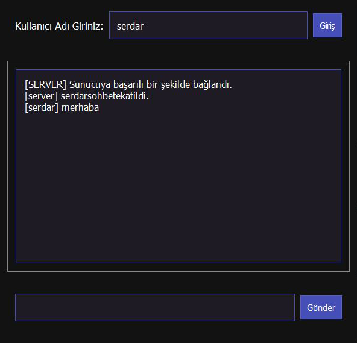
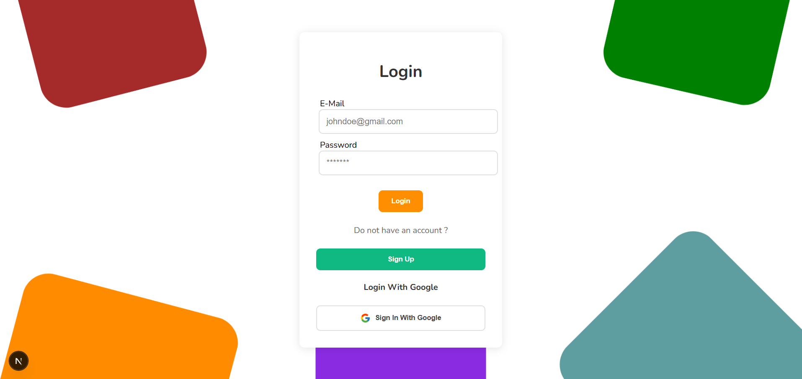
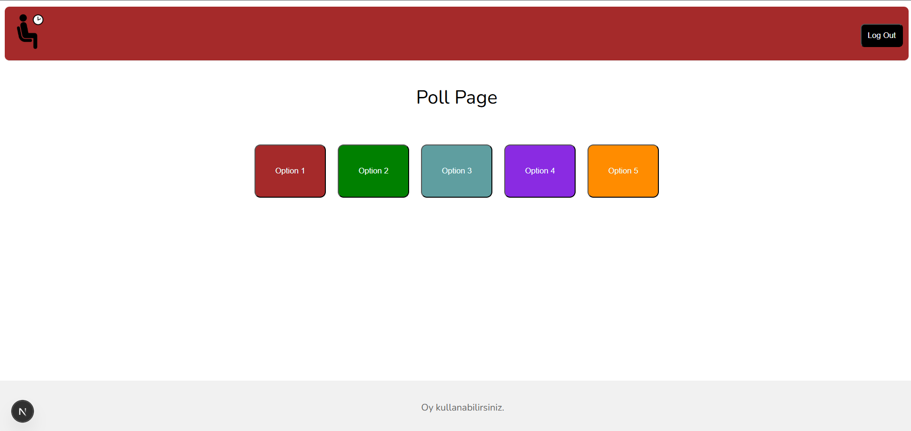
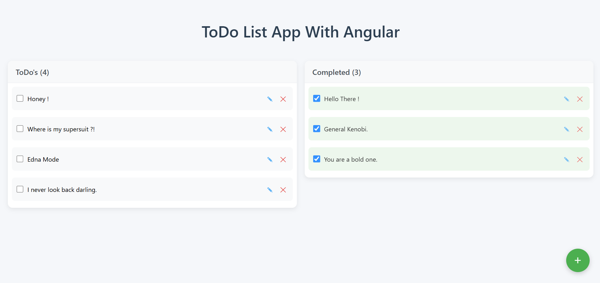

# Junior Frontend Developer

#### Technical Skills: Next.JS, React.JS, JavaScript, Python, HTML & CSS, WordPress & Elementor, GraphQL, SQL, MySQL, Angular, Vue.js, Java, C, C#, PHP, Team	Management		       

## Work Experience
**LLM Trainer @ Turing (_September 2025 - Current_)**
- Designed and refined user and system prompts to enhance the training of large language models (LLMs).
- Developed workflows and use cases ensuring clarity and real-world applicability across diverse scenarios. 
- Provided necessary identities and information for accurate tool usage, minimizing hallucinations in model outputs.

**Assistant Squad Leader & Web Development Intern @ GAOTek Inc. (_July 2024 - October 2024_)**
- Promoted to Assistant Team Lead at GAOTek Inc. for demonstrating strong technical and leadership capabilities. 
- Supervised and guided a team of 54 interns, ensuring timely task completion and resolving queries. 
- Conducted daily meetings to train new squad leaders, facilitating smooth leadership transitions.
- Acknowledged by senior management for effective team management and delivering results under tight deadlines.
- Developed and managed dynamic websites using WordPress, enhancing user experience and functionality. 
- Integrated essential plugins such as WooCommerce and Elementor to optimize site performance.
- Created a custom Ajax search bar with a dynamic dropdown filter, streamlining user navigation. 
- Improved SEO by resolving orphan pages, significantly enhancing website structure and visibility.

**Web Development Intern @ Retodi (_July 2023 - August 2023_)**
- Collaborated with Fizibil Engineering Software & Informatics on diverse web development projects. 
- Developed personal and professional websites utilizing Next.js and React.js, enhancing modern web technology skills. 
- Designed a custom-themed institutional website to align with client branding and functional needs. 
- Created a functional e-commerce website focused on user experience and product display.

**Software Engineering Intern @ Uğur Optical Machines (_July 2022 - August 2022_)**
- Assisted in refining software for a device measuring interpupillary distance (IPD) to enhance user experience.
- Diagnosed and corrected software errors, improving personalized eyewear recommendations based on user preferences. 
- Collaborated with the engineering team to ensure compliance with technical specifications and user-centered design standards.

## Projects
### Encrypted Messaging Software In A Network Environment Using Playfair Cipher With Turkish Alphabet
[GitHub Link](https://github.com/serdestonat/playfair-crypted-text-software)

The objective of this project is to create a messaging software that encrypts messages in the server and decrypts them in the client, using **Python**. Since it is a Turkish version of a Playfair Cipher, we needed to make adjustments of our own. For example, a regular Playfair Cipher is a 5x5 matrix wheras our matrix is a 6x6 due to fact that Turkish alphabet is a 29 letter alphabet and the remaining 7 spots of that 6x6 matrix are filled with various punctuation marks such as "." , "," "!", "?" etc.

### A Poll Website With Google Authentication & Manual Registration

Used **Next.JS** to make a functioning poll website. When you are registered and logged in, this website allows you to vote every 5 minutes. You cannot vote again until 5 minutes after your last vote. Every account has its own cooldowns. Meaning that you can vote with one account to a button of your preferance, log out, log in again with a different account and vote again. You cannot jump into the poll page without logging in. If you try that you will get a warning and you will be redirected to the login page after 3 seconds. There are five options for you to vote, each in different color. The color of the navbar changes its color depending on which option has the most votes. There is also a custom 404 page as well.

### A ToDo List With Drag & Drop
[GitHub Link](https://github.com/serdestonat/angular-todo-app)

Using **Angular**, I made a ToDo List app with a drag and drop feature. Used local storage to store the items. You can check the checkboxes to mark an item as completed or you can drag the item and drop in to the "Completed" section. The lastest item you add to the "ToDo's" section appears at the top of the list. However you can arrange the list to your liking with the drag and drop feature within the each section as well. You can also edit the items if you ever need a correction.

## Certifications
- Certificate Of Training In Web Development - GAOTek Inc. @ October 2024
- Certificate Of Training In Digital Marketing - GAOTek Inc. @ October 2024
- Certificate Of Internship - GAOTek Inc. @ October 2024
- First Steps Towards AI - Global AI Hub @ September 2025
- Introduction To Deep Learning - Global AI Hub @ September 2025
- Scrum Master & Agile Scrum Certification - Paul Ashun, Udemy @ November 2024
- IELTS Academic - Overall Band Score : 7.5 @ December 2024

## Education
- Bachelor's Degree, Computer Engineering | Trakya University		
