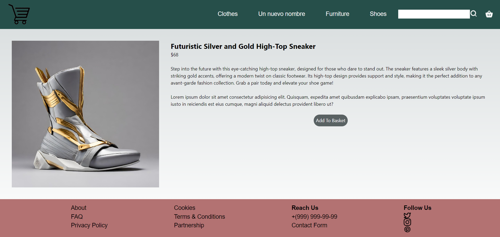
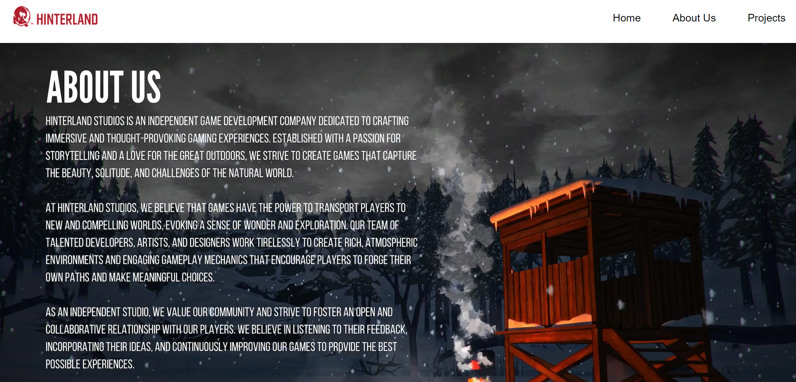

# Software Engineer

#### Technical Skills: JavaScript, Next.JS, React.JS, Python, SQL, Kotlin (Jetpack Compose), HTML & CSS, Flutter, Java, C, C#, PHP, Assembly x86, WordPress, Elementor

## Education
- Bachelor's Degree, Computer Engineering | Trakya University		 				       

## Work Experience
**Assistant Squad Leader (ASL) @ GAOTek Inc. (_July 2024 - October 2024_)**
- Team Leadership: Promoted to Assistant Squad Leader for demonstrating strong technical and leadership capabilities.
- Intern Management: Supervised and guided a team of 54 interns, resolving queries and ensuring timely task completion.
- Training & Development: Conducted daily meetings and trained new squad leaders and assistant squad leaders for smooth leadership transitions.
- Project Coordination: Reviewed daily reports, monitored progress, and assigned tasks based on individual strengths and project requirements.
- Performance Tracking: Maintained and updated attendance and tracking sheets for accurate record-keeping.
- Recognition: Acknowledged by senior management for efficiently managing teams and delivering results within tight deadlines.

**Web Developer Intern @GAOTek Inc. (_July 2024 - October 2024_)**
- WordPress Development: Created and managed dynamic websites using WordPress, integrating plugins like WooCommerce, YITH, Contact Form 7, and Elementor.
- Custom PHP Solutions: Developed a custom Ajax search bar with a dynamic dropdown category filter using PHP, eliminating the need for additional plugins.
- SEO Enhancement: Improved website structure by identifying and resolving orphan pages, enhancing SEO and user navigation.

**Software Engineering Intern @ Retodi (_July 2023 - August 2023_)**
- Web Development Projects: Partnered with Fizibil Engineering Software & Informatics on various web development initiatives.
- Next.js & React.js Expertise: Developed personal and professional websites using Next.js and React.js, strengthening proficiency in modern web technologies.
- Custom Theming: Created an institutional website with a custom theme, ensuring alignment with client branding and functional requirements.
- E-commerce Development: Built a functional e-commerce website focusing on product display, user experience, and cart functionality, excluding the payment system as per project scope.

**Voluntary Software Engineering Trainee @ Uğur Optik Makina (_July 2022 - Augutst 2022_)**
- Software Refinement: Assisted in adjusting and refining software for a device measuring interpupillary distance (IPD).
- Error Diagnosis: Diagnosed and corrected software errors to enhance the accuracy of personalized eyewear recommendations based on user lifestyle and preferences.
- Cross-functional Collaboration: Worked with the engineering team to ensure the device met technical specifications and user-centered design standards.

## Projects
### Encrypted Messaging Software In A Network Environment Using Playfair Cipher With Turkish Alphabet
[GitHub Link](https://github.com/serdestonat/playfair-crypted-text-software)

The objective of this project is to create a messaging software that encrypts messages in the server and decrypts them in the client, using **Python**. Since it is a Turkish version of a Playfair Cipher, we needed to make adjustments of our own. For example, a regular Playfair Cipher is a 5x5 matrix wheras our matrix is a 6x6 due to fact that Turkish alphabet is a 29 letter alphabet and the remaining 7 spots of that 6x6 matrix are filled with various punctuation marks such as "." , "," "!", "?" etc.

### A Functional E-Commerce Website 
[GitHub Link](https://github.com/serdestonat/e-commerce)

Used **Next.JS** to make a functioning e-commerce website using REST API. This website can add items to cart, delete them from the cart and you can decide the quantity of items. Categories and items are pulled from an API. You can search items from a search bar with an incluison of a "Scroll To Top" button. But since the API is public the items and categories may change and not shown properly from time to time.

### A Corporate Website
[GitHub Link](https://github.com/serdestonat/website-nextjs)

Using **Next.JS**, I made a corporate website inspired from my favorite game **The Long Dark**. It includes a functioning "Contact Us" form, dranwn map from Google Maps, and also a "Scroll To Top" button.
